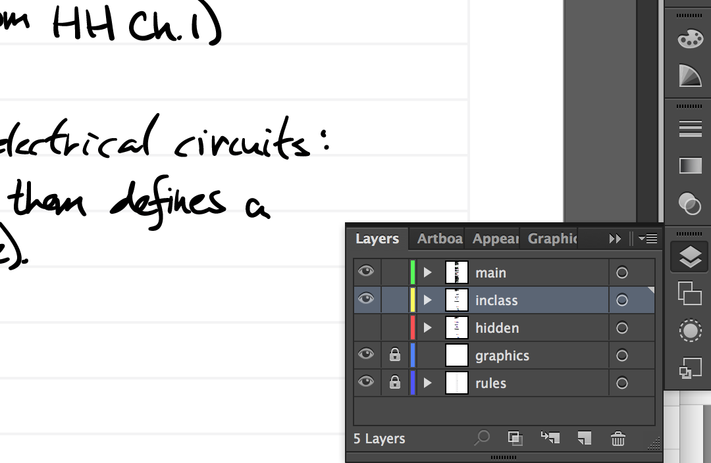
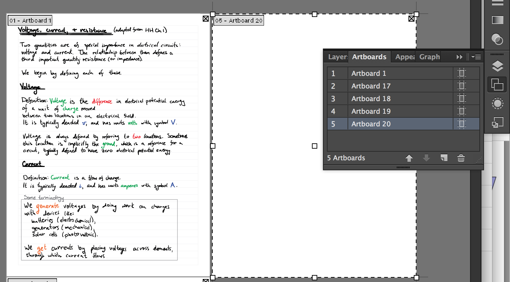

# Illustrator Noter

This project is a way for me to share my method of making, organizing, and distributing course notes. It's idiosyncratic as hell.

## Requirements

This has been tested under Mac OS X 10.11.6 (15G31). It should work on most modern Macs. It may work on Linux. It requires the bash shell.

Adobe Illustrator must be installed. I've tested it with AI CS6. It may work with other Illustrator versions.

## Installation

The distribution is simply a directory containing some scripts and some example courses. Clone/download the directory to your machine. I structured it so that all your notes will exist inside this directory, with individual courses at the second level. In practice, I actually change this structure, but this is the easiest way to distribute it, rationally.

At the top level, you'll see the following files and folders.

    callScripts.scpt
    me316_2016F
    me345_2016F
    mySaveAsArchivePDFs.jsx
    processAllNotes.command
    processNotes.sh

Unless something breaks, don't worry about messing with `callScripts.scpt`, `mySaveAsArchivePDFs.jsx`, and `processNotes.sh`. Read the next two sentences before executing the first sentence. Open `processAllNotes.command` in a plain text editor (TextEdit is fine). **Do not** double-click the file to open it; it will execute ... do something like alt-click and use `Open With ...`. Notice that the array `coursesArray` has the following entries.

    me345_2016F
    me316_2016F

These are example courses that contain example Illustrator `.ai` files. I suggest not messing with `processAllNotes.command` for now.

Browse the directory `ME345_2016F`. You will see three `.ai` files that are my notes for the first three lectures in the course. Ignore the `mySaveAsArchivePDFs.jsx` shortcut ... it has to be there, pointing to `mySaveAsArchivePDFs.jsx` at the level above, but you needn't mess with it.

Open up the lecture notes `ME345_2016F_001_BasicElectronics.ai` in Illustrator. Open up the **Layers** palette. You should see something like this.

The top layer `main` is used for writing most of the notes. The second layer `inclass` is used to write in class. The hidden layer `hidden` contains the portions of the notes you'd like your students not to see until you fill it in, in class. The `graphics` layer can be unlocked and graphics (like pictures) added to it. Re-lock it so it's easier to draw on the graphics. The `rules` layer has the light gray rules on it.

My workflow is like this: first write my notes in `main`, then select the regions I'd like for my students to fill-in in class and move them to `hidden`.

Notice that there's more than one page in this set of notes. Well, Illustrator doesn't actually have the concept of "page," but "artboards" are essentially the same thing. These artboards are letter size. When you reach the bottom of a page and would like a new page, you can create one by opening the **Artboards** palette and clicking **New Artboard** at the bottom. You should see something like the following.

